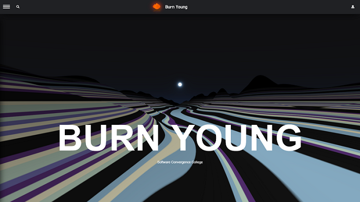

# MODAKBUL
> 세종대학교 제 3대 소프트웨어융합대학 단과대학교 홈페이지

<p></p>

본 프로젝트는 세종대학교 소프트웨어융합대학 단과대학교 제 3대 학생회 "번영"에서 주최하는 웹 소설 공모전으로서, 대상을 수상한 프로젝트 결과물입니다.

본 프로젝트는 기존의 단과대학교 홈페이지의 문제점을 파악하여 이를 개선하기 위한 새로운 시스템을 구축하였으며, 현 시스템의 구조는 Tagging System으로 모든 객체들이 태그 기반으로 분류를 짓고 있습니다.

More: https://bonfire-2.gitbook.io/modakbul/

## Development environment

- Mac OS
- Python 3.7
- MySQL 5.7.4
- JavaScript

## Installation

OS X & Linux:

```sh
git clone https://github.com/837477/MODAKBUL.git
```

Windows:

```sh
git clone https://github.com/837477/MODAKBUL.git
```

Development setup:

```sh
pip install -r requirement.txt
```

## Usage example

Execution:

```
python3 app.py
```

## Release History

* Work in progress

## Meta

🙋🏻‍♂️ Name: 837477 

📧 E-mail: 8374770@gmail.com

📔 Blog: http://837477.pythonanywhere.com

🐱 Github: https://github.com/837477

## Contributing

1. Fork it (<https://github.com/837477/MODAKBUL>)
2. Create your feature branch (`git checkout -b feature/fooBar`)
3. Commit your changes (`git commit -am 'Add some fooBar'`)
4. Push to the branch (`git push origin feature/fooBar`)
5. Create a new Pull Request